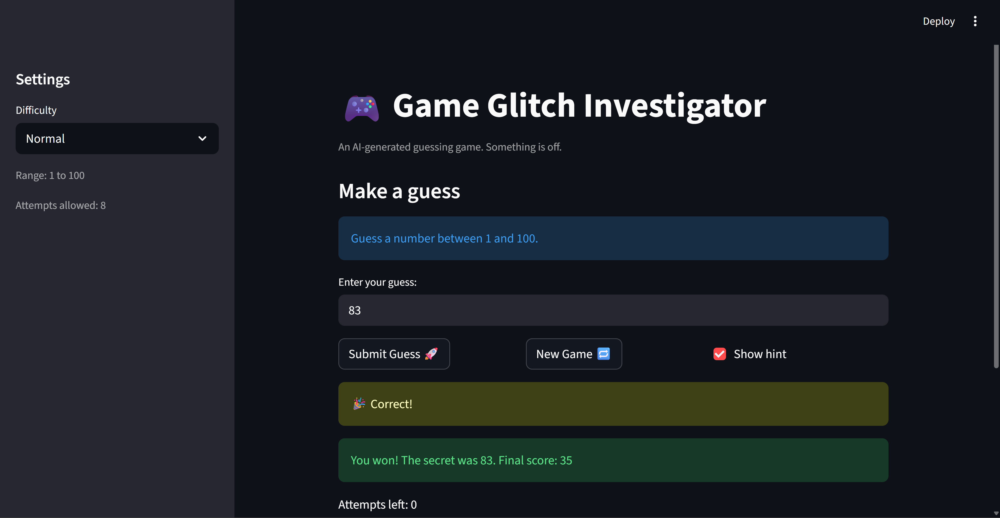

# 🎮 Game Glitch Investigator: The Impossible Guesser

## 🚨 The Situation

You asked an AI to build a simple "Number Guessing Game" using Streamlit.
It wrote the code, ran away, and now the game is unplayable. 

- You can't win.
- The hints lie to you.
- The secret number seems to have commitment issues.

## 🛠️ Setup

1. Install dependencies: `pip install -r requirements.txt`
2. Run the broken app: `python -m streamlit run app.py`

## 🕵️‍♂️ Your Mission

1. **Play the game.** Open the "Developer Debug Info" tab in the app to see the secret number. Try to win.
2. **Find the State Bug.** Why does the secret number change every time you click "Submit"? Ask ChatGPT: *"How do I keep a variable from resetting in Streamlit when I click a button?"*
3. **Fix the Logic.** The hints ("Higher/Lower") are wrong. Fix them.
4. **Refactor & Test.** - Move the logic into `logic_utils.py`.
   - Run `pytest` in your terminal.
   - Keep fixing until all tests pass!

## 📝 Document Your Experience

- [ ] Describe the game's purpose.
The game's purpose is to provide a fun experience for the player where they can play a guessing game with numbers. Depending on the hint they are given (or if they don't want any hints), they use their intelligence and luck to correctly guess the secret number. It is made to be a fun challenge for players, as well as quick so it is a game they cannot get tired of.
- [ ] Detail which bugs you found.
The first bugs I noticed were when I opened the website and I saw the Developer Debug Info was visible, which can be annoying to the player since it is not relevant to their playing. Then, when I started playing, I noticed that the hints were leading me in the wrong direction because when the hint said to guess higher, the secret number was lower than my guess. Additionally, when I still had a guess left, the secret number was revealed to me. After I put in the secret number as my last guess, it would tell me try again when I still should have been playing the game and won. I clicked the new game button afterwards and realized that it was broken. It would change the starting attempts from 8 to 7 and wouldn't let me play a new game even though it started to set up one. Overall, I noticed the attempt limits were not what they should be because guesses only started after the second guess. The instructions also didn't change depending which difficulty the player selected.
- [ ] Explain what fixes you applied.
I mainly worked on fixing the logic to get the hints working correctly. I worked on the if-else conditionals that dealt with the "Go Higher" and "Go Lower" logic so it would correctly input "Go Higher" if the guess was lower than the secret number and "Go Lower" if the guess was higher than the secret number. Then, later on, I refacted this logic into logic_utils.py as well as the other functions so the app.py file looked cleaner. In order to make the Developer Debug Info not visible to the player, I commented out the logic since it is not relevant to the person who is online to play the game. The attempt limit logic was also moved further down into the code logic so first the guess the player makes is validated by the game and then the attempt is counted as an actual one, meaning it decrements afterwards. This makes sure that the attempts start counting down as soon as the user guesses, not until the second guess. To fix the new game button, I made sure the state session variable was changed to playing so it is registered that the user wants to play another game and the game will act as it does during the playing session. It correctly resets the secret number and number of attempts so the game is actually ready to be played again. A change to the statement handling the instructions message with the correct range of numbers the user should guess was made where the variables low and high were used instead of the static 1 and 100. 

## 📸 Demo

- [ ] [Insert a screenshot of your fixed, winning game here]

## 🚀 Stretch Features

- [ ] [If you choose to complete Challenge 4, insert a screenshot of your Enhanced Game UI here]
